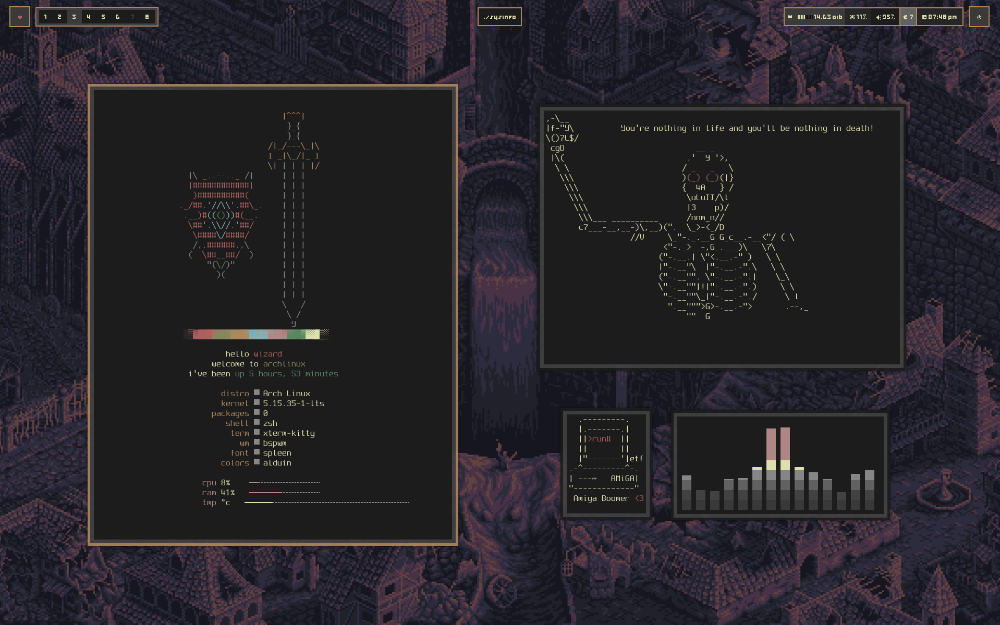

## Wizard

## Info

- OS: [Arch Linux](https://archlinux.org/)
- Window Manager: [bspwm](https://github.com/baskerville/bspwm)
- Keyboard Manager [sxhkd]()
- AUR Helper [paru]()
- Terminal: [kitty](https://github.com/kovidgoyal/kitty)
- Terminal Session Manager [tmux]()
- Shell: [zsh](https://www.zsh.org/)
- Bar: [polybar](https://github.com/polybar/polybar)
- Fonts: [spleen](https://github.com/fcambus/spleen)
- Editor: [nvim](https://github.com/neovim/neovim)
- App Launcher: [rofi](https://github.com/davatorium/rofi)
- Compositor: [picom](https://github.com/yshui/picom)
- GTK Theme: [gtk]()
- Color scheme: [alduin](https://github.com/AlessandroYorba/Alduin)
- Audio Controler [pavucontrol]()
- Cool Sound Bars [cava]()
- Calendar: [calcurse]()
- Alternative cat [bat]()
- PDF Viewer [zathura]()
- Screnshots [flameshot]()
- Photo Viewer [sxiv]()
- Edit Photos [gimp]()
- Wallpaper Manager [nitrogen]()
- Password Manager [pass]()
- Passwords in the Cloud :eyes: [keybase]()
- Share Mouse & Keyboard Across Devices [barrier]()
- Pretty Printing Sysinfo [neofetch]()

## TODO

boarders doesn't work
polybar doesn't work
remove commends from config files/clean up configs
rofi fonts are not correct
something is wrong with shortcuts
polybar doesn't seem to work well, only the first bar is loaded
polybar doesn't have opacity
there is something wrong with the gtk theme.
gtk themes are not loaded
nitrogen needs the /pictures/wallpaper directory

## NOTES

I changed the width of polybar in the vm to 1640
I changed the workspaces in bspwmrc

The following was a major sources of inspiration.
- [Barbaross93](https://github.com/Barbaross93/Muspelheim)
