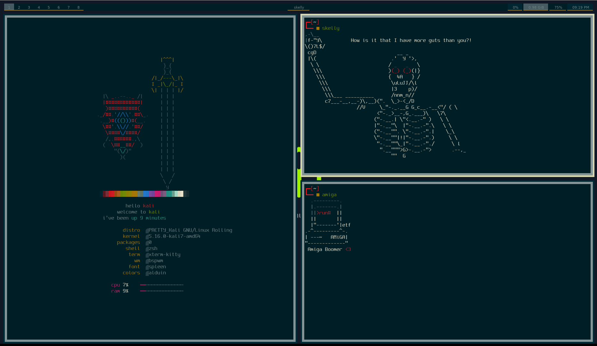

## Wizard

## Info

- OS: [Kali Linux]()
- Window Manager: [bspwm](https://github.com/baskerville/bspwm)
- Keyboard Manager [sxhkd]()
- Terminal: [kitty](https://github.com/kovidgoyal/kitty)
- Terminal Session Manager [tmux]()
- Shell: [zsh](https://www.zsh.org/)
- Bar: [polybar](https://github.com/polybar/polybar)
- Fonts: [spleen](https://github.com/fcambus/spleen)
- Editor: [nvim](https://github.com/neovim/neovim)
- App Launcher: [rofi](https://github.com/davatorium/rofi)
- GTK Theme: [gtk]()
- Color scheme: [htb]()
- Audio Controler [pavucontrol]()
- Alternative cat [bat]()
- PDF Viewer [zathura]()
- Photo Viewer [sxiv]()
- Wallpaper Manager [nitrogen]()
- Pretty Printing Sysinfo [neofetch]()

## TODO

better colors and maybe start new htb theme
load a gtk theme
change polybar theme
change nvim theme
change the fonts to rofi, terminal
bat is not working (batcat)

## NOTES

nitrogen needs the /pictures/wallpaper directory
I changed the width of polybar in the vm to 1640
I changed the workspaces in bspwmrc
fix .local files
check https://github.com/theGuildHall/pwnbox/tree/master/.config/JetBrains
maybe ps2p

The following was a major sources of inspiration.
- [Barbaross93](https://github.com/Barbaross93/Muspelheim)
